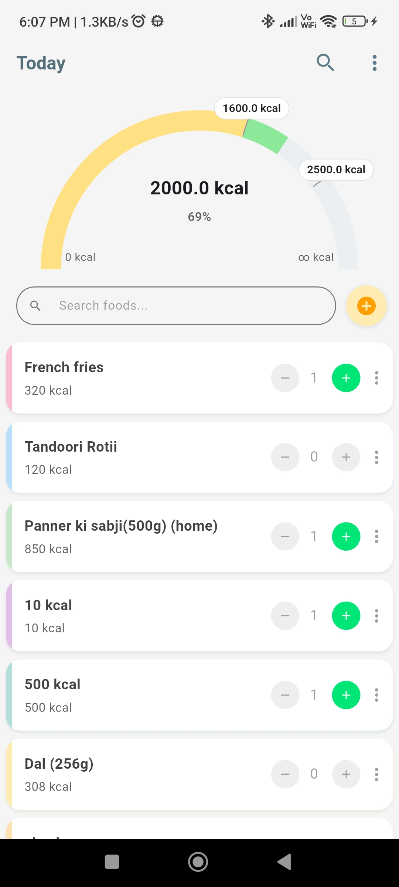
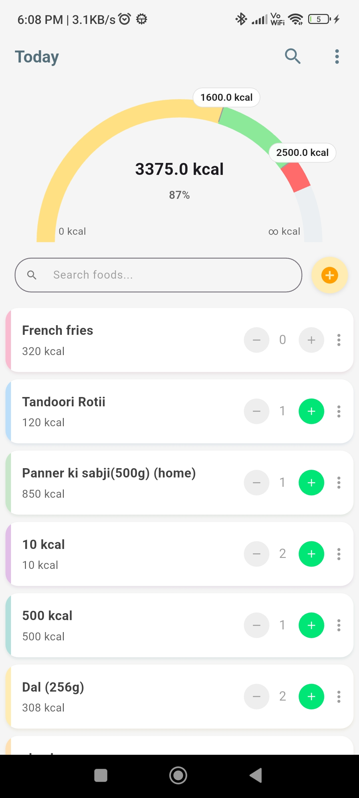
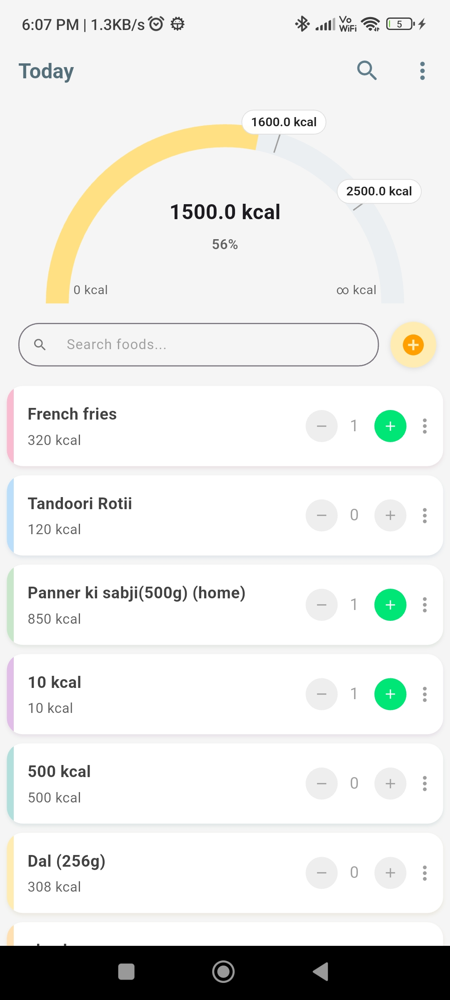
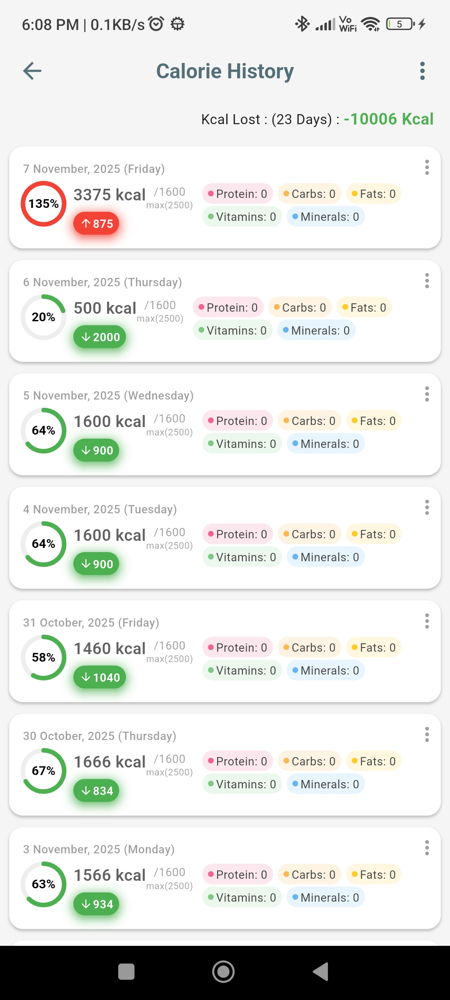

<table style="width: 100%;">
  <tr>
    <td align="center">
      
       Ideal
    </td>
    <td align="center">
      
       Over
    </td>
    <td align="center">
      
       Under
    </td>
    <td align="center">
      
       History
    </td>
  </tr>
</table>

# Calio – Calorie Tracker App

Calio is a **cross-platform calorie tracking app** built with **Flutter**, supporting **Android, iOS, and Web**. It helps users monitor their daily calorie intake, track food history, and visualize progress over time with heatmaps and statistics.

---

## Features

- **MVVM architecture** using Riverpod for clean, maintainable code
- **Firebase Authentication** for one-click login
- **Firebase backend** for cloud storage and device sync
- **Drift integration** for offline storage
- **Cross-platform support** for mobile and web
- **Add, edit, and delete foods** with full CRUD support
- **Food history page** to monitor trends
- **Heatmaps** to visualize progress
- **Search and filter** foods easily
